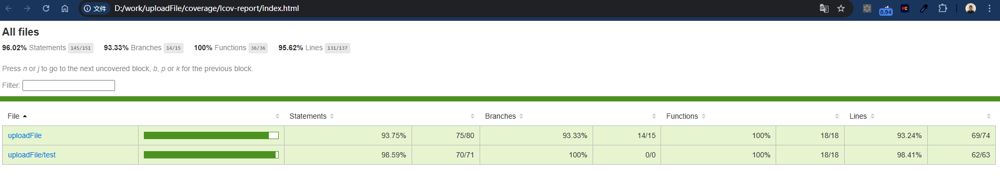

# This is a demo to show how the upload file component works.

# Environment:
node: v16.20.0

npm: v8.19.4

# Supported Commands:

* npm start
    - trigger the simulation usage of the uploadBigFile component in success and cancel scenario
* npm run start_success
    - trigger the simulation usage of the uploadBigFile component in success scenario
* npm run start_cancel
    - trigger the simulation usage of the uploadBigFile component in cancel scenario
* npm test
    - trigger the unit test to the uploadBigFile component
* npm run coverage
    - trigger the unit test and generate the coverage for the uploadBigFile component

# Description:

The index.ts contains the detail implemenation regarding how the uploadBigFile compnoent works.

Since we don't have a sever to upload a big file. The implemenation is simulating the big file upload process using a `setInterval` to increase the count from 0 to 100 for invidial file chunk, eventually demostrate how to upload a big file with multiple chunks.

# Deployment and verification:

In the project root folder to run below commands to verify the component:

1. npm install

2. npm start

So you should see something like this: 

```
$ npm start

> test_uploadfile@1.0.0 start
> npm run start_success && npm run start_cancel


> test_uploadfile@1.0.0 start_success
> npx ts-node --esm main_success.ts

Upload progress: 0.00%
Upload progress: 0.01%
Upload progress: 0.01%
...
Upload progress: 92.99%
Upload progress: 94.99%
Upload progress: 97.00%
Upload progress: 99.00%
Upload progress: 100.00%
Upload succeeded

> test_uploadfile@1.0.0 start_cancel
> npx ts-node --esm main_cancelled.ts

Upload progress: 0.00%
Upload progress: 0.01%
Upload progress: 0.01%
Upload progress: 0.02%
Upload progress: 0.02%
Upload progress: 0.02%
Upload progress: 0.03%

Upload progress: 0.08%
Upload canceled
```

# Code Instruction

1. index.ts: This file contains the actual code regarding how the upload file component is implemented.
2. main_success.ts: This is a code file which is able to trigger a file upload success test.
3. main_cancelled.ts: This is a code file which is able to trigger a file upload cancelled test.


In order to trigger a file upload failed test.

Please comment out index.ts: Line#32, and uncomment the line#33, then execute the command `npm run start_success`

and you should see something like this:

```
$ npm run start_success

> test_uploadfile@1.0.0 start_success
> npx ts-node --esm main_success.ts

Upload progress: 0.00%
Upload progress: 0.01%
Upload progress: 0.01%
Upload progress: 0.02%
Upload progress: 0.02%
Upload progress: 0.02%
Upload progress: 0.03%
Upload progress: 0.03%
...

Upload progress: 0.08%
Upload progress: 0.08%
Upload progress: 0.08%
Upload failed: Chunk 0 upload failed
Upload progress: 0.07%
Upload failed: Chunk 1 upload failed
Upload progress: 0.05%
Upload failed: Chunk 2 upload failed
Upload progress: 0.04%
Upload failed: Chunk 3 upload failed
Upload progress: 0.02%
Upload failed: Chunk 4 upload failed

```

You could also simply switch to branch `fix/fail_scenario` and execute `npm run main_success` command to trigger the failed test scenario as well.


# Unit Test

The code has added unit test to the uploadBigFile component.

You can run the command: `npm run test` to trigger the mocha unit test: You should see something like below:

```
$ npm run test

> test_uploadfile@1.0.0 test
> mocha -r ts-node/register "test/*.spec.ts"


  uploadChunk function
    √ should upload a chunk successfully (1005ms)
    √ should cancel the upload (201ms)

  uploadBigFile function
    √ should start uploading and call onProgress (1002ms)
    √ should stop uploading
    √ should continue uploading after stopping (1001ms)
    √ should cancel uploading (502ms)


  6 passing (4s)
```


The code has also added coverage generation, 

You can run the command: `npm run coverage` to generate the code coverage: You should see something like below:
```
$ npm run coverage

> test_uploadfile@1.0.0 coverage
> nyc -r lcov -e .ts -x "*.test.ts" npm run test


> test_uploadfile@1.0.0 test
> mocha -r ts-node/register "test/*.spec.ts"


  uploadChunk function
    √ should upload a chunk successfully (1005ms)
    √ should cancel the upload (203ms)

  uploadBigFile function
    √ should start uploading and call onProgress (1002ms)
    √ should stop uploading
    √ should continue uploading after stopping (1000ms)
    √ should cancel uploading (502ms)


  6 passing (4s)
```

Open the root/coverage/lcov-report/index.html file, you can see the coverage for the uploadBigFile component:

